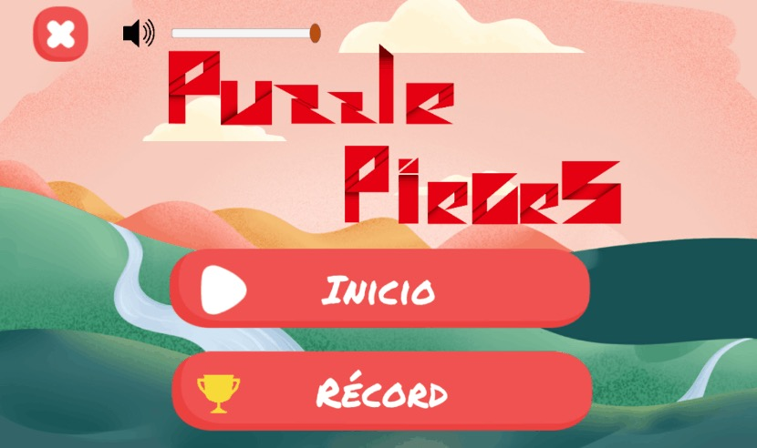
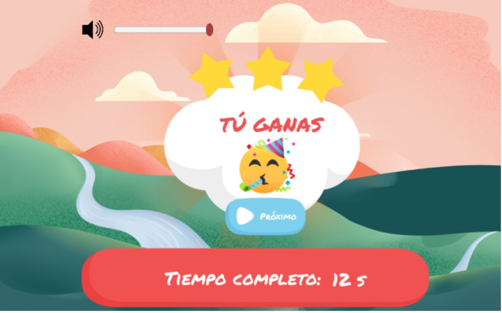
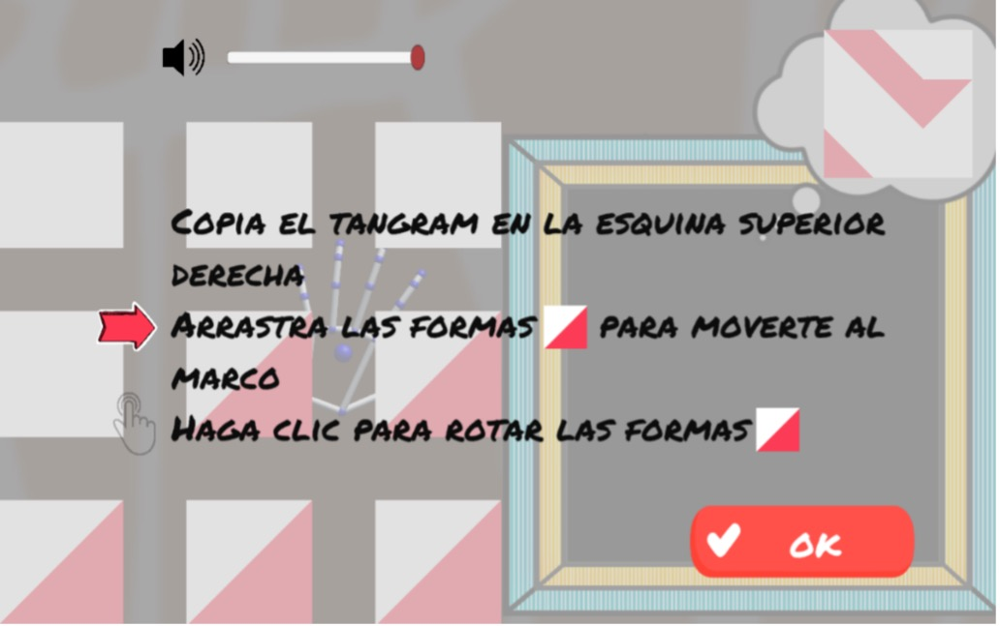
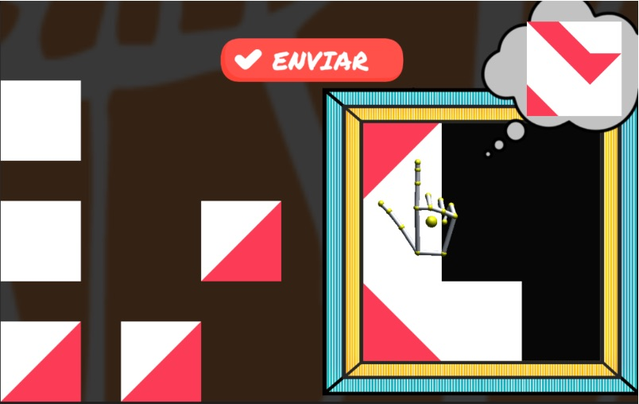
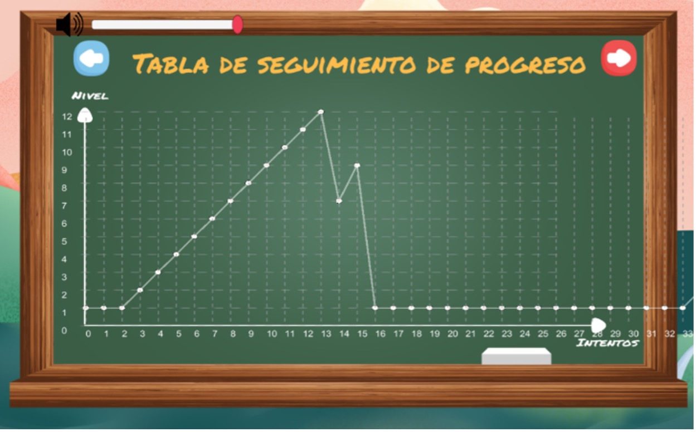

# Puzzle Pieces

**Puzzle Pieces** is a Unity-based educational puzzle game with two interaction modes:

- **Windows version** — contactless gesture interaction using the Leap Motion Controller.
- **Android version** — touch-screen interaction.

The game includes multiple puzzle levels, different play modes, player selection, level progression, and performance-record pages.

## Downloads

The final public builds are available from the GitHub Releases page:

```text
https://github.com/emilyykchan/PuzzlePieces/releases
```

Recommended release assets:

```text
PuzzlePieces_Spanish_0420_Android.zip
PuzzlePieces_Spanish_0420_Windows.zip
```

The Android ZIP contains the `.apk` and required data files:

```text
PuzzlePieces_Spanish_0420.apk
NameList.json
Level.json
Emily.json
```

The Windows ZIP contains the `.exe` and required Unity runtime/data files.

## Screenshots

### Home screen



### Level and difficulty selection


### Gameplay





### Gesture interaction



### Performance records



## Repository structure

```text
PuzzlePieces/
├── Assets/              Unity assets, scenes, scripts, prefabs, audio, and sprites
├── Packages/            Unity package manifest
├── ProjectSettings/     Unity project settings
├── Builds/              Legacy/demo build files and build notes
├── docs/                User documentation, screenshots, and example config files
├── README.md
├── LICENSE
└── .gitignore
```

The core Unity project files are:

```text
Assets/
Packages/
ProjectSettings/
```

Unity-generated folders such as `Library/`, `Temp/`, `Obj/`, IDE files, and `.DS_Store` files are intentionally excluded from Git.

## Documentation

Detailed usage instructions are provided in:

```text
docs/android.md
docs/windows.md
```

The Android guide explains how to install the APK and copy the required JSON configuration files into the Android app data folder.

The Windows guide explains how to launch the Windows build and use the Leap Motion Controller.

## Configuration and records

The game uses two main configuration files:

```text
Assets/NameList.json
Assets/Level.json
```

- `NameList.json` contains the built-in player list.
- `Level.json` contains game level information.

Example copies are provided in:

```text
docs/config/NameList.example.json
docs/config/Level.example.json
```

During gameplay, player performance records are saved as individual JSON files:

```text
{name}.json
```

Anonymised sample record files are provided in:

```text
docs/config/sample-records/
```

These examples show the structure of the saved performance data used by the record/performance pages.

## Legacy builds

This repository retains older Android APK builds in:

```text
Builds/Android/
```

These files are kept for archival purposes and may not represent the final version of the project.

For the final public build, use the ZIP files attached to the GitHub Release.

## Licence

Copyright (c) 2026 Emily Chan. All rights reserved.

This repository is made publicly available for portfolio, educational, research, and archival purposes. Personal, educational, research, and evaluation use is permitted, but commercial use, redistribution, sublicensing, or publication of modified versions is not permitted without prior written permission.

See `LICENSE` for details.

Third-party Unity assets, packages, fonts, audio files, plugins, and libraries remain subject to their original licences and terms.